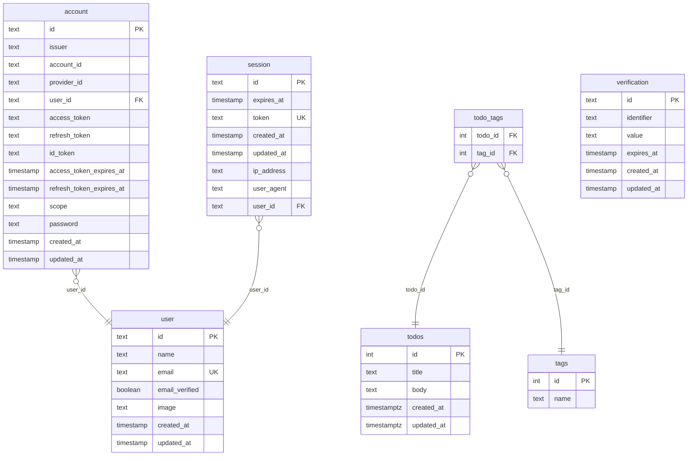

# Tables

| Name | Columns | Comment |
|------|---------|---------|
| [account](./account.md) | 14 |  |
| [session](./session.md) | 8 |  |
| [tags](./tags.md) | 2 |  |
| [todo_tags](./todo_tags.md) | 2 |  |
| [todos](./todos.md) | 5 |  |
| [user](./user.md) | 7 |  |
| [verification](./verification.md) | 6 |  |

---

## ER Diagram

